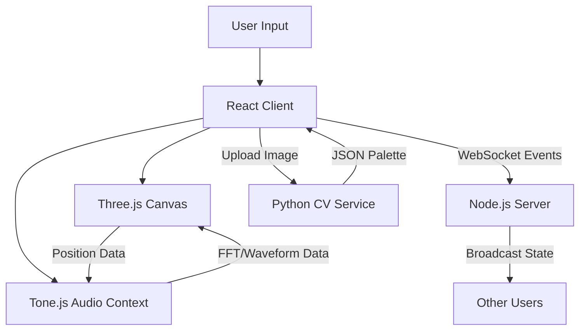

# 🌌 AuraSpace

> **Turn space into sound. A collaborative, physics-based 3D audio playground.**

**AuraSpace** is a spatial audio synthesizer that breaks away from linear timelines and terminal interfaces. Instead of writing code or arranging tracks, you inhabit a 3D environment where position, physics, and gravity dictate the composition. Walk through a mist of reverb, throw objects to trigger beats, and invite friends to jam in the same virtual room.

---

## 🎮 Core Concept

Most music software treats sound as a flat waveform on a timeline. **AuraSpace** treats sound as a physical object in a 3D world.

### The "Sound Garden"

* **Proximity Mixing:** Volume and panning are controlled by your avatar's position relative to "Sound Totems."
* **Physics Sequencers:** A drum loop isn't a pre-recorded file; it's a bouncing ball in a virtual box. Change the room's gravity to alter the tempo. Change the wall elasticity to alter the swing.
* **Visual Feedback:** Sounds pulse, glow, and distort the environment based on their frequency content.

---

## ✨ Key Features

* **Spatial Composition:** Place synths, drums, and samples in 3D space. The "mix" changes as you explore the environment.
* **Physics-Based Modulation:** Throw objects to create stochastic rhythms. Use "gravity" as a global parameter for delay times and LFO speeds.
* **Multiplayer Jamming:** built on WebSockets. See other users as floating avatars; hear what they hear, or collaborate to build a room-sized instrument.
* **Vision-to-Vibe (AI):** Upload a photo of your physical room. The system analyzes the lighting and clutter (via Computer Vision) to generate a matching sonic palette (e.g., "Dark Industrial" or "Sunny Lo-Fi").

---

## 🛠 Tech Stack

**Frontend (The Experience)**

* **React** + **Vite**: UI Framework.
* **React Three Fiber (R3F) / Three.js**: 3D rendering engine and physics (Cannon.js).
* **Tone.js** / **Web Audio API**: Audio synthesis and spatialization engine.

**Backend (The Brains)**

* **Node.js** + **Socket.io**: Real-time state synchronization for multiplayer sessions.
* **Python (FastAPI)**: Lightweight service for the "Vision-to-Vibe" image analysis.

---

## 🚀 Getting Started

### Prerequisites

* Node.js v18+
* Python 3.9+ (Optional, for AI features)

### Installation

1. **Clone the repository**
```bash
git clone https://github.com/frangedev/auraspace.git
cd auraspace

```


2. **Install Frontend Dependencies**
```bash
cd client
npm install

```


3. **Install Server Dependencies**
```bash
cd ../server
npm install

```


4. **Run Development Mode**
```bash
# Terminal A: Start the Client
cd client && npm run dev

# Terminal B: Start the Signaling Server
cd server && npm run start

```


---

## 🕹️ Controls & Usage

| Input | Action |
| --- | --- |
| **W A S D** | Move your Avatar (Listener position) |
| **Mouse Drag** | Look around |
| **Spacebar** | Jump / Trigger Physics Impulse |
| **Left Click** | Place a "Sound Totem" at cursor location |
| **Right Click** | Open Object Properties (Select Synth, Pitch, Scale) |
| **Scroll** | Adjust "Gravity" (Global Tempo) |

---

## 🧩 Architecture



---

## 🗺 Roadmap

* [ ] **Phase 1:** Basic 3D environment with simple oscillator Totems.
* [ ] **Phase 2:** Physics integration (bouncing balls for rhythm).
* [ ] **Phase 3:** Multiplayer synchronization (Socket.io).
* [ ] **Phase 4:** WebXR support (VR/AR viewing).
* [ ] **Phase 5:** MIDI Export (Capture the "movement" as MIDI data).

---

## 🤝 Contributing

We welcome contributions! Please see `CONTRIBUTING.md` for details on how to submit pull requests.

1. Fork the Project
2. Create your Feature Branch (`git checkout -b feature/AmazingFeature`)
3. Commit your Changes (`git commit -m 'Add some AmazingFeature'`)
4. Push to the Branch (`git push origin feature/AmazingFeature`)
5. Open a Pull Request

---

## 📄 License

Distributed under the MIT License. See `LICENSE` for more information.

---

**Created by [Mehmet T. AKALIN](https://dv.com.tr) | [Digital Vision**](https://dv.com.tr)
